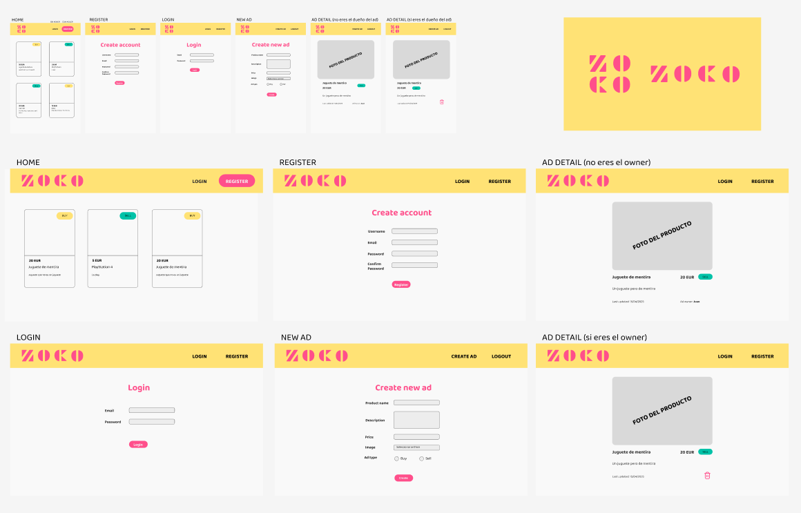

# Proyecto Frontend: ZOCO

Este proyecto es una práctica de frontend desarrollada como parte del bootcamp de Desarrollo Web Fullstack de KeepCoding. Consiste en una aplicación web de compra-venta de productos diseñada y construida desde cero utilizando **HTML**, **CSS** y **JavaScript**.

## Diseño

La interfaz fue diseñada por mí usando **Figma**, priorizando una experiencia visual limpia, intuitiva y adaptada al usuario.



## Tecnologías utilizadas

- HTML5
- CSS3
- JavaScript
- sparrest.js (API REST basada en json-server)

## Funcionalidades principales

- Listado de anuncios: Cada anuncio muestra su foto, nombre, descripción, precio y si es de compra o de venta. En caso de que el usuario no incluya una imagen, se a;ade una por defecto con el logo de ZOCO.
- Detalle del anuncio: Muestra toda la información relacionada con el anuncio, incluida la fecha de actualización y el nombre del dueño del anuncio. Si el usuario que está viendo el detalle del anuncio está logado y, además es quien ha publicado el anuncio, en vez de su nombre como creador verá una papelera con la que puede borrar el anuncio si lo desea.
- Creación de un anuncio: Sólo los usuarios logados podrán acceder a este formulario. Deben proporcionar obligatoriamente el nombre del producto, una descripción, el precio y si es un anuncio de compra o de venta.
- Login: Muestra un formulario donde el usuario debe introducir su correo y contraseña.
- Botón de logout: para cerrar la sesión del usuario.
- Registro: Como el formulario del login; el usuario debe introducir un nombre, su correo y su contraseña, además de que confirmar la contraseña introducida.
- Gestión de estados de interfaz: En cada pantalla se gestionan los estados vacío (no hay anuncios), error (se produce un error al cargar), carga (mientras carga la información de la página desde el backend) y éxito (cuando se obtiene la información sin problemas).

## Uso de la API REST

Para gestionar usuarios y datos dinámicos, este proyecto utiliza **sparrest.js**, un servidor local basado en **json-server** que simula un backend real.  
Entre los endpoints disponibles se encuentran:

- **POST /auth/register**: Registro de usuarios.
- **POST /auth/login**: Autenticación de usuarios y obtención de un token JWT.
- **POST /upload**: Subida de archivos.
- **/api/**: Endpoints CRUD protegidos mediante autenticación JWT.

### Instrucciones básicas para levantar el servidor:

1. Clonar el repositorio de sparrest.js.
2. Instalar dependencias:
   ```bash
   npm install
   ```
3. Iniciar el servidor:
    ```bash
    npm start
    ```
    El servidor estará disponible en http://127.0.0.1:8000.

## Cómo ejecutar este proyecto

1. Clona este repositorio:
    ```bash
    git clone https://github.com/PaulaBCdev/practica_frontend
    ```
2. Abre el archivo `index.html` directamente en tu navegador web.

